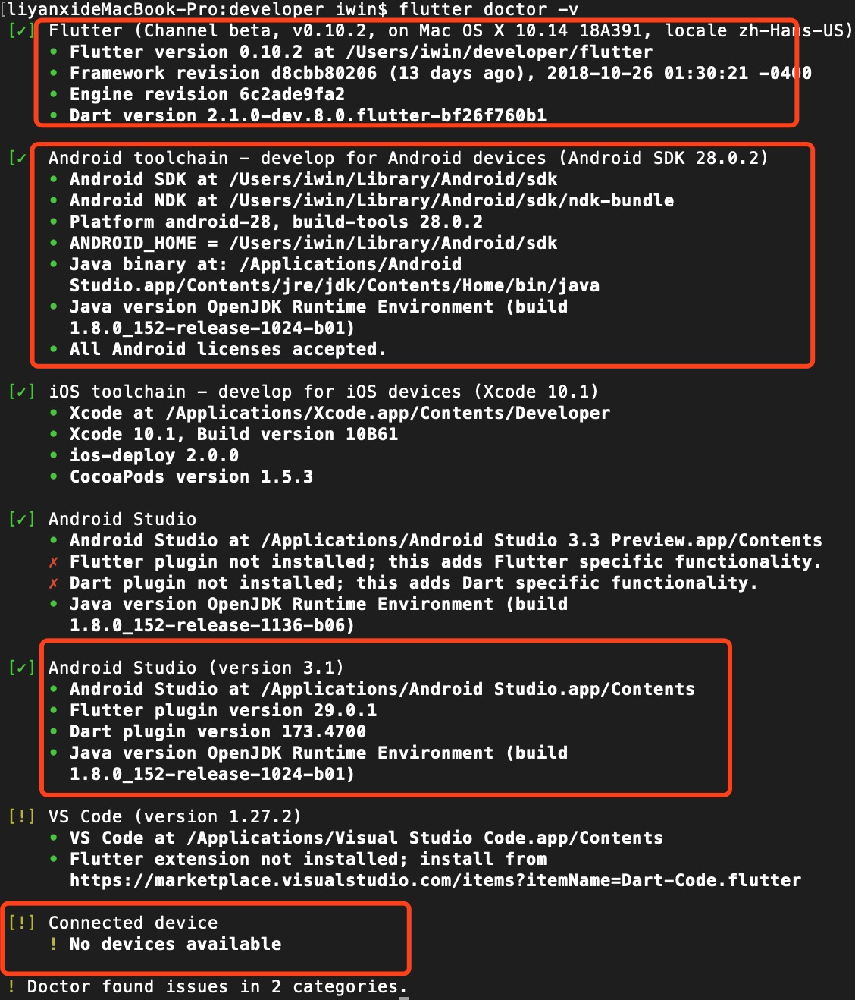
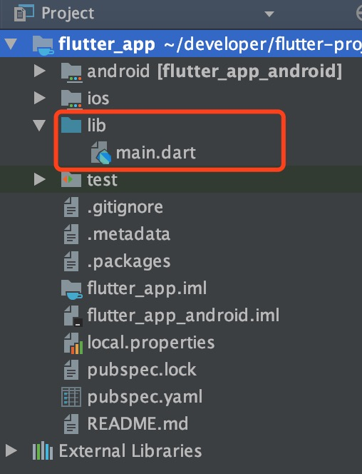
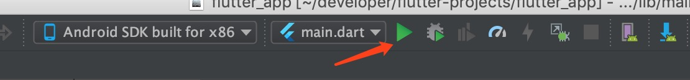
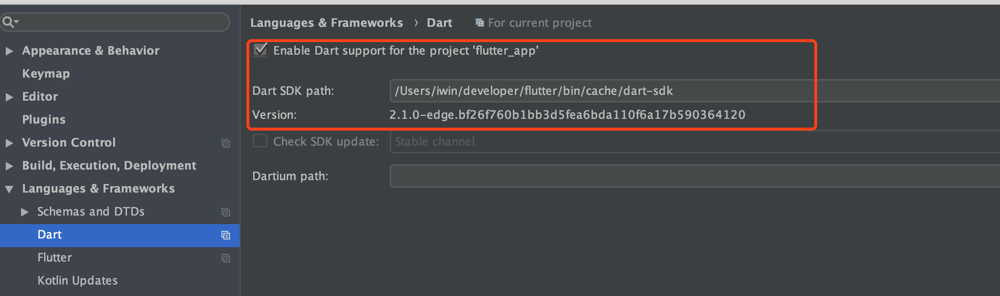
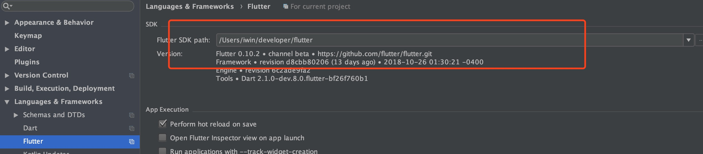
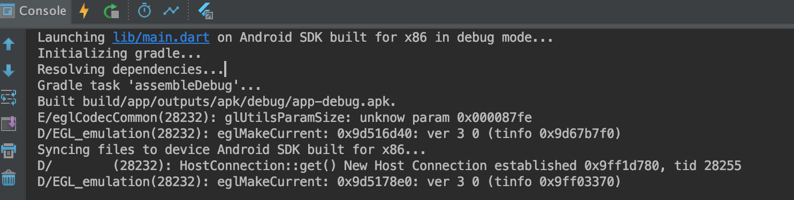
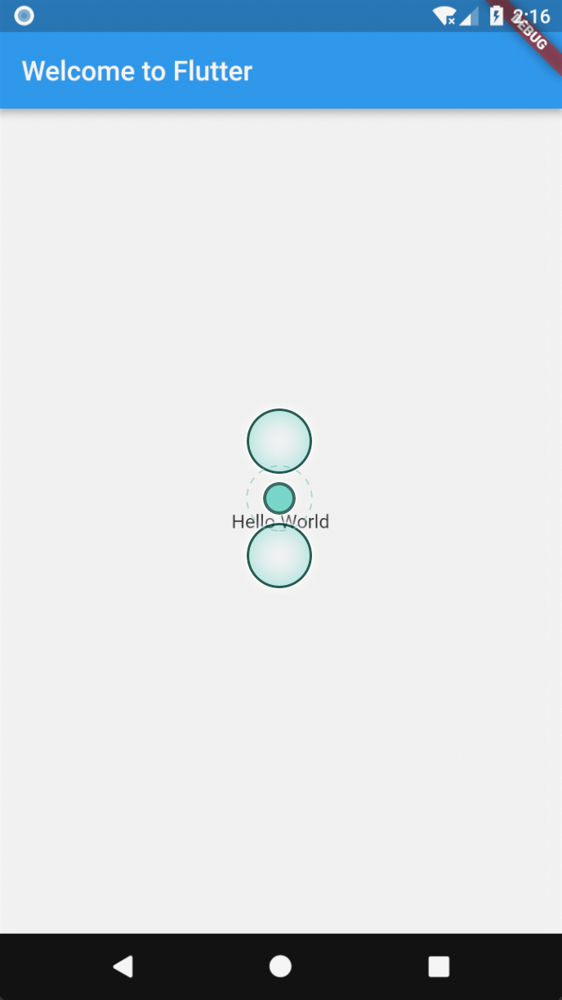

<!--## Flutter入坑系列之开发环境搭建-->


*虽说Flutter出现有一段时间了，但大家对它的了解却不是很深，但直到2018谷歌开发者大会在上海的召开，它才真正进入开发者的世界。Flutter的出现为跨平台开发开辟了新的方向，但是与之相应的中文学习文档却不是很多，因此针对这一考虑我们会持续输出一系列Flutter方面的实践性学习文档以及配套demo供大家学习。万里之行始于足下，下面我们就开始Flutter入坑的第一篇——Flutter开发环境搭建。*

### Flutter 安装
关于Flutter的安装，本文以 macOS 系统为例，就 macOS 系统下Flutter的安装细节进行说明。其它平台（Windowns、Linux）可参考[官方文档](https://flutter.io/docs/get-started/install)安装步骤。

#### 自备梯子或使用国内镜像
做过开发的都晓得，国内访问Google是不行的，因此此处我们需要做一些前期配置，拥有梯子的可自行跳过。没有梯子的同志也不用担心，Flutter官方并不会放弃我们这么重要的用户，他们专门为中国开发者搭建了临时镜像，大家可以将环境变量加入到当前用户环境中，具体操作如下：

```
export PUB_HOSTED_URL=https://pub.flutter-io.cn
export FLUTTER_STORAGE_BASE_URL=https://storage.flutter-io.cn
```
这里的配置仅限当前窗口使用，如果需要永久使用请参考后面小节**更新环境变量**配置
*注意：此镜像为临时镜像，并不能保证一直可用，读者可以关注[Using Flutter in China](https://github.com/flutter/flutter/wiki/Using-Flutter-in-China)以获得有关镜像服务器的最新动态。*

#### 获取Flutter SDK
获取 Flutter 有多种方式：
1. 去Flutter官网下载稳定可用的安装包，[转到下载页](https://flutter.io/docs/development/tools/sdk/archive#macos)
2. 第一种方式可能需要翻墙，也可直接从Github上Flutter项目下去下载安装包，[转到下载页](https://github.com/flutter/flutter/releases)。对应指令`git clone -b dev https://github.com/flutter/flutter.git`(可针对当前版本做命令的调整)

*上述两种第一种需要解压，第二种不需要，总之将它们放置到您想放到的地方*

### 更新环境变量
大家都知道此时`flutter`还不是全局变量，为了方便我们以后的调用，这里我们需要做一些全局性的配置，具体命令如下：

```
export PATH= ~/developer/flutter/bin:$PATH //flutter 存放位置，替换为您自己的即可
export ANDROID_HOME="~/Library/Android/sdk" //android sdk目录，替换为您自己的即可
export PATH=${PATH}:${ANDROID_HOME}/tools
export PATH=${PATH}:${ANDROID_HOME}/platform-tools
export PUB_HOSTED_URL=https://pub.flutter-io.cn
export FLUTTER_STORAGE_BASE_URL=https://storage.flutter-io.cn
```
*打开（或创建）~/.bash_profile文件,将下面的命令粘贴进去,注意：此处Flutter与Android SDK的路径需要替换为自己的，保存之后运行`source $~/.bash_profile`刷新当前终端窗口。*

### 运行 flutter doctor
经过上面的步骤，此时我们就可以运行以下命令查看是否需要安装其它依赖项来完成安装，这个过程第一次可能需要耗费一段时间，下次就会快很多：

```
flutter doctor
```
该命令依赖检查您的环境并在终端窗口显示报告。如下是我运行输出的结果：

**运行异常情况：**

```
[-] Android toolchain - develop for Android devices
    • Android SDK at /Users/obiwan/Library/Android/sdk
    ✗ Android SDK is missing command line tools; download from https://goo.gl/XxQghQ
    • Try re-installing or updating your Android SDK,
      visit https://flutter.io/setup/#android-setup for detailed instructions.
```

*一般的错误会是xcode或Android Studio版本太低、或者没有ANDROID_HOME环境变量等，请按照提示解决。*

**运行正常情况：**


*这里我们只关注红色方框内的，这里有四部分下面逐一解释（Android，先不考虑IOS情况，处理一致）：*

* 第一部分监测的是Flutter相关依赖项结果，如果第一次运行会先去下载；
* 第二部分针对Android SDK和Java方面的检测，如果缺失，对应条目前方会显示✗红色标记，那就需要您根据缺失条目提示进行配置，这里不做深入；
* 第三部分针对编译器（Android Studio）内部插件（Flutter、Dart）的安装检测，插件的安装将会在下一章节详细讲解；
* 第四部分是对连接设备的检测，我这里没有启动设备，则显示无可用设备。

### 编译器Flutter插件安装
适合Flutter使用的编译器有很多（IDE、VSCode、Xcode），这里我以Android Studio为例演示下如何安装Flutter相关插件（***注意：这里Android Studio需要 3.0或更高版本***）：

1. 首先启动Android Studio，打开插件首选项(Preferences>Plugins on macOS, File>Settings>Plugins on Windows & Linux)；
2. 选择 **Browse repositories…**, 选择 Flutter 插件并点击 install（此处Dart插件回一起安装）；
3. 重启Android Studio后插件生效； 

### 体验Flutter
经过上面的步骤，Flutter需要的相关环境基本已经配置完毕，下面我们就创建一个工程实践下，我们的配置是否可行：
#### 创建应用
1. 打开Android Studio 选择**File>New Flutter Project**
2. 选择**Flutter application**作为project类型，然后点击Next
3. 输入项目名称（如myapp），然后点击Next
4. 点击**Finish**
5. 创建完成

下面请看默认Flutter工程的目录结构：

*在项目目录中，您应用程序的代码位于 `lib/main.dart`.*
#### 运行

*点击上述绿色三角执行程序，您有可能遇到一些异常现象比如：dart not support 或 flutter not found sdk 等等，那么你就得查看下如下两处地方是否配置正确：*
*开启Dart支持:*

*Flutter SDK路径配置:*


*然后再次运行,即日志界面的执行过程如下：*

*查看模拟器运行结果--HelloWorld：*


到此说明我们的开发环境安装正确，但不代表您们也会这么顺利，毕竟每个人都电脑环境不一致，如遇到问题可给我留言，我们一起探讨，～谢谢～！

**注释：下一篇我们将会带领您们如何一步步创建我们第一个Flutter应用与相关代码分析**